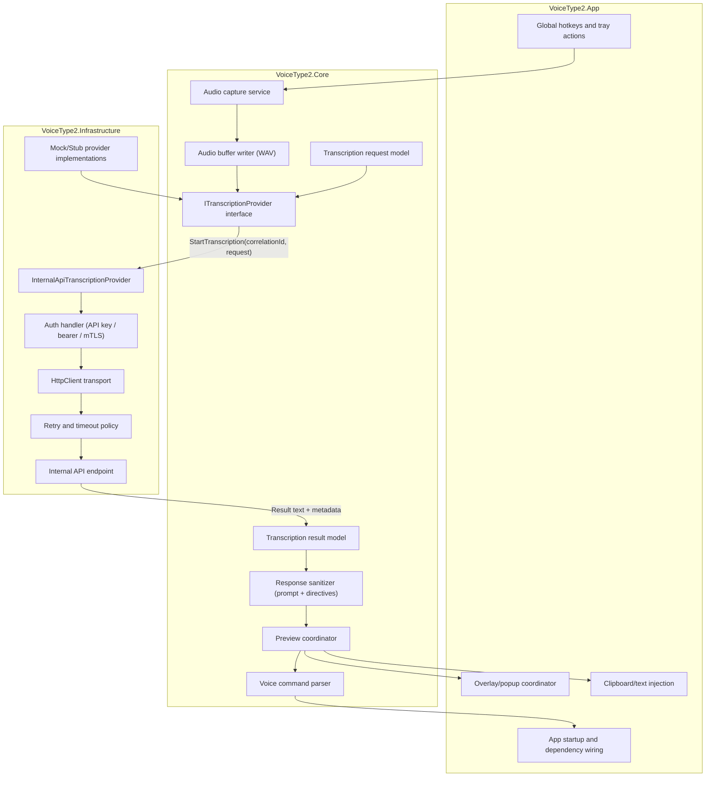
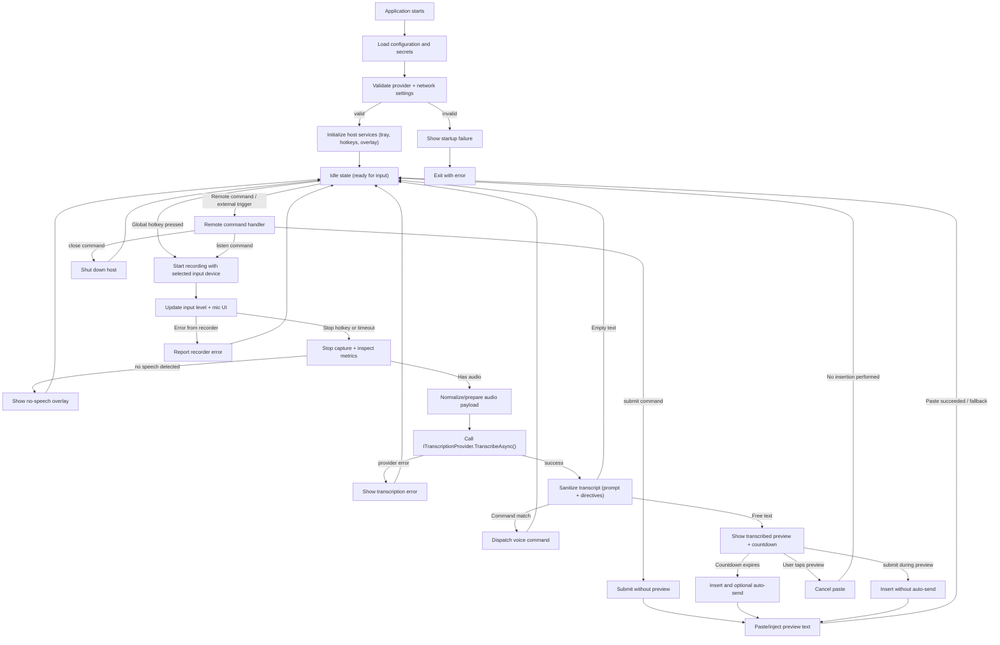
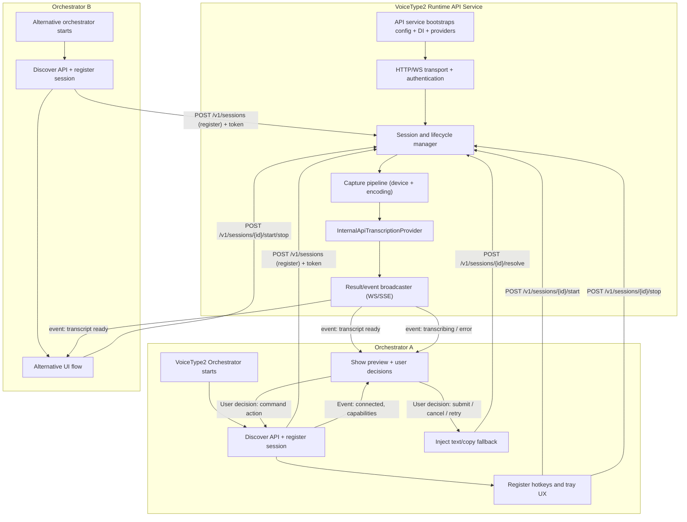

# VoiceType2 — Internal API Migration Plan (C#)

## 1) Deep study of the current VoiceType implementation

This repo already has a stable Windows tray dictation app with clear separation between:

- Process bootstrap + CLI + single-instance routing (`VoiceType/Program.cs`)
- Runtime orchestration and dictation flow (`VoiceType/TrayContext.cs`)
- Hotkey handling + overlay + settings reload (`VoiceType/TrayContext.cs`)
- Audio capture (`VoiceType/AudioRecorder.cs`)
- Transcription provider (`VoiceType/TranscriptionService.cs`)
- Paste/injection (`VoiceType/TextInjector.cs`)
- Config persistence + DPAPI key protection (`VoiceType/AppConfig.cs`)
- Remote command policy/dispatch (`VoiceType/RemoteCommandManager.cs`)

Current end-to-end path is:

1. User presses trigger hotkey → `TrayContext` starts/stops recording.
2. Audio buffer is built by `AudioRecorder` (NAudio `WaveInEvent`) and finalized to WAV in `AudioRecorder.Stop()`.
3. `TrayContext` calls `TranscriptionService.TranscribeAsync()` (OpenAI SDK client).
4. Response text is sanitized (`PretextDetector`) then optionally parsed as a voice command (`VoiceCommandParser`).
5. Text is inserted via clipboard/paste (`TextInjector`) after preview countdown.

Constraints that matter for migration:

- `net9.0-windows` + WinForms + user32 interop + native clipboard/paste mechanics.
- Current dependency on OpenAI .NET package is concentrated in one place (`TranscriptionService`), but call site assumptions are embedded in `TrayContext`.
- Config is currently file-based at `%LOCALAPPDATA%\VoiceType\config.json`, with API key decryption via DPAPI on load/save.
- Existing tests cover config normalization, command parsing, preview flow, and prompt sanitization, not API transport internals.

## 2) VoiceType2 objective

Build a new standalone version of the app with the same user goals as VoiceType, while implementing everything in a clean-room C# architecture.

Primary goals:

- Preserve user-facing behavior (tray lifecycle, hotkeys, overlay, preview, injection, commands).
- Put transcription behind an internal API abstraction from day one.
- Maintain testability with injected fake transport clients.
- Keep VoiceType2 independent from VoiceType1 runtime, startup flow, and transport implementation.

## 3) Recommended C# architecture (for `VoiceType2`)

### 3.1 Layered design

- `VoiceType2.App` (WinForms host)
  - Implement independently with lessons learned from VoiceType.
  - Keep Windows-specific concerns in this layer.
- `VoiceType2.Core`
  - Audio pipeline interfaces
  - Command/parser layer interfaces
  - Preview/injection coordinator interfaces
  - Domain models
- `VoiceType2.Infrastructure.Transcription`
  - Internal API client implementation
  - Auth/token plumbing
  - Retry + telemetry + timeout policies
- `VoiceType2.Infrastructure.Config`
  - Config model extension for internal API endpoint/auth
- `VoiceType2.Infrastructure.TestDoubles`
  - Mock/fake implementations for integration-less tests.

### 3.1.1 Internal API data flow (Mermaid)



### 3.1.2 Proposed application flow (Mermaid)



### 3.1.3 Proposed API-First architecture (headless API + pluggable orchestrators)



### 3.2 Core interface contract

```csharp
public interface ITranscriptionProvider
{
    Task<TranscriptionResult> TranscribeAsync(
        Stream audioWav,
        string correlationId,
        TranscriptionOptions options,
        CancellationToken cancellationToken = default);
}

public sealed record TranscriptionResult(
    string Text,
    string Provider,
    TimeSpan ProcessingLatency,
    bool IsSuccess,
    string? ErrorCode = null,
    string? ErrorMessage = null,
    string? RawPayload = null);

public sealed record TranscriptionOptions(
    string? Language = null,
    string? Prompt = null,
    bool EnablePrompt = true,
    int? MaxTokens = null);
```

### 3.3 Internal API implementation concept

- `InternalApiTranscriptionProvider : ITranscriptionProvider`
- Sends:
  - `POST /v1/voice/transcriptions`
  - multipart form or JSON+base64 payload
  - metadata: `correlationId`, `language`, `prompt`, `format` (`wav`), `sampleRate`.
- Returns:
  - `text` and optional provider metadata.
- Security options:
  - Bearer token in `Authorization` header
  - mTLS/client cert if needed
  - short-lived token from local helper service.

Use retry policy (e.g. `HttpClient` + exponential backoff) and strict timeout around `TranscribeAsync`.

## 4) Config changes

Add to `AppConfig` in VoiceType2:

- `TranscriptionProvider` (`"InternalApi"` | `"Mock"` | `"Stub"`)
- `InternalApiBaseUrl`
- `InternalApiApiPath`
- `InternalApiAuthMode` (`"apikey"` / `"bearer"` / `"none"`)
- `InternalApiApiKeyOrToken` (stored using DPAPI semantics, same model as current `ApiKey`)
- `InternalApiTimeoutMs`

Behavior:

- If provider is `InternalApi`, instantiate `InternalApiTranscriptionProvider`.
- If provider is `Mock`/`Stub`, inject test implementations from configuration.
- Preserve existing prompt and audio normalization behavior.

## 5) Migration plan (practical 5-phase path)

1. **Scaffold VoiceType2**
   - Create `VoiceType2` solution folder with `VoiceType2.Core`, `VoiceType2.App`, `VoiceType2.Infrastructure`.
   - Keep shared helpers only if explicitly extracted to avoid coupling to VoiceType1.
2. **Introduce provider abstraction**
   - Implement `ITranscriptionProvider`.
   - Build a fresh transcription flow around the interface.
   - Refactor host logic to call abstraction only.
3. **Build internal API client**
   - Add `HttpClient` typed client, options, auth handler, request/response DTOs.
   - Add retry and timeout policy.
   - Add structured logs with correlation IDs.
4. **Configuration + runtime behavior**
   - Add config schema + migration defaults.
   - Add provider selection startup validation.
   - Fail fast for unsupported provider modes, except when running in explicit test/fallback stubs.
5. **Verification + cutover**
   - Add VoiceType2 unit/integration tests with provider/test doubles.
   - Add end-to-end smoke checks for:
     - hotkey start/stop,
     - silence/short clip handling,
     - preview cancel/submit,
     - injection path.
   - Validate against your internal API contract before broad rollout.

## 6) Risks and controls

- **Windows-only API surface**: keep `TextInjector` + overlay behavior in host app (same restrictions).
- **Audio format drift**: ensure `AudioRecorder` still emits exact WAV PCM mono 16-bit and preserves the current fallback/sample-rate behavior.
- **API contract brittleness**: version responses (`v1` contracts) and explicit error schema needed.
- **Security drift**: keep DPAPI for local secrets; avoid writing raw tokens in logs.
- **Latency**: preview duration is user-facing; expose provider latency in logs and tune timeout.

## 7) Expected outcome

By splitting VoiceType2 around `ITranscriptionProvider`, you get:

- zero rewrite of UI/hotkey/overlay/paste flow,
- a clean separation between host and transcription transport,
- and a system that is independent of VoiceType1 design debt.

The first deliverable is this design + minimal refactor pass to get abstraction points in place; productionization is then incremental.
