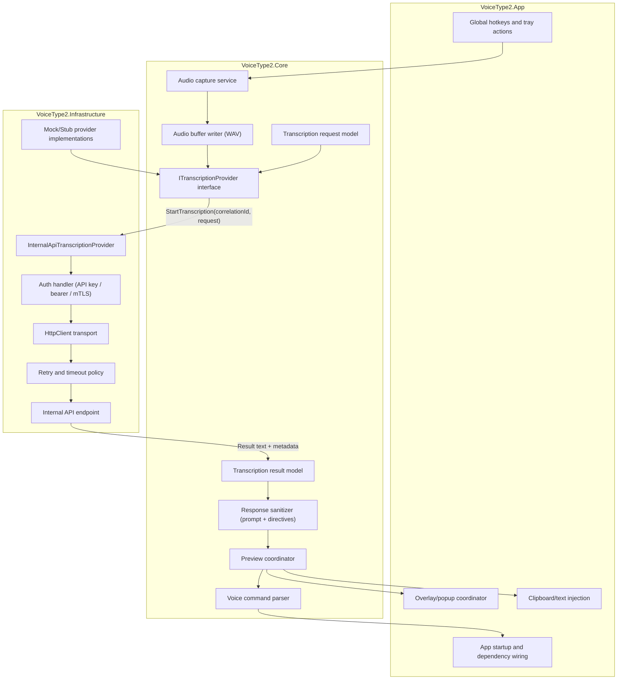
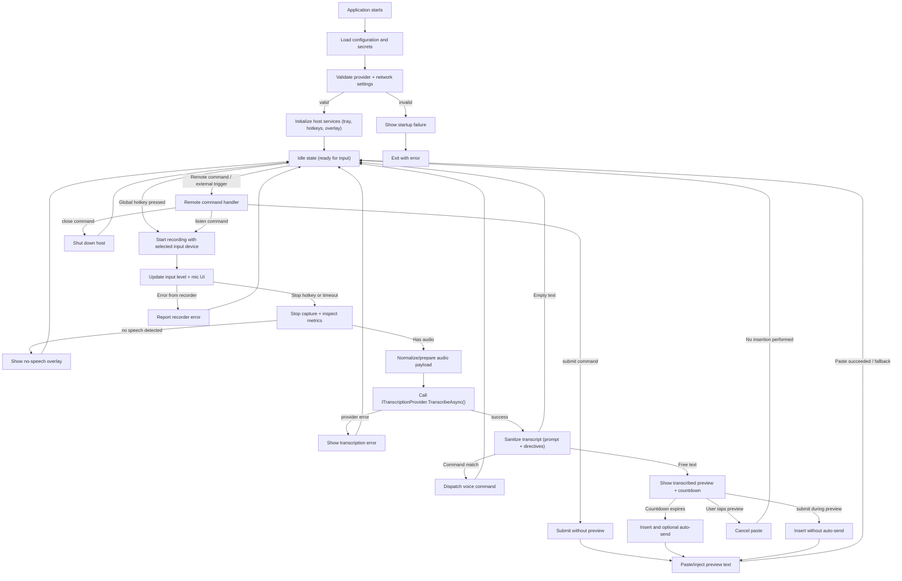
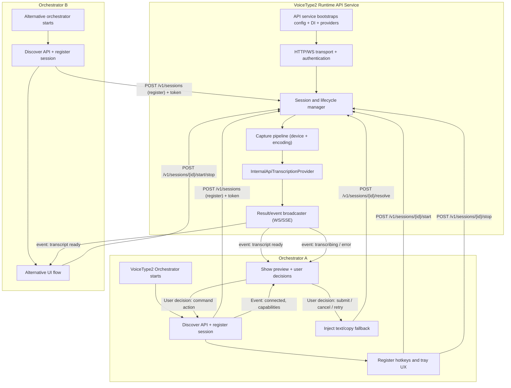
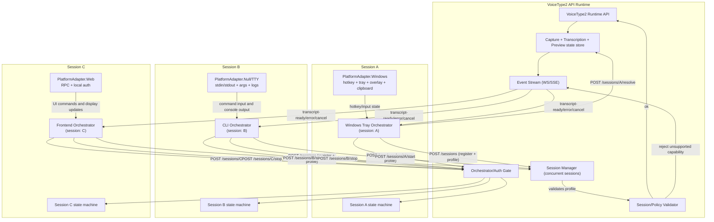
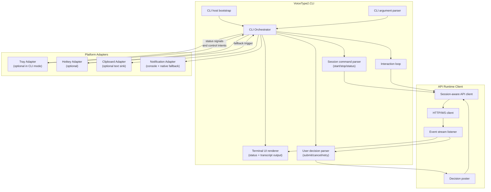
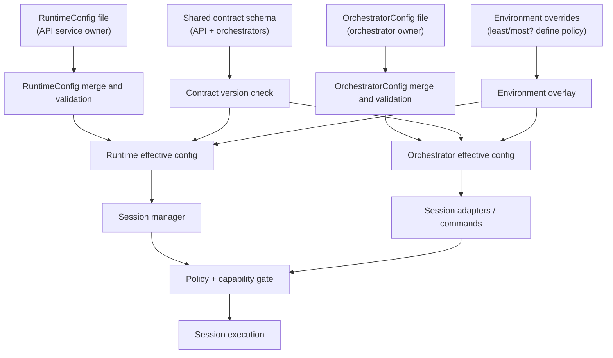

# VoiceType2 — Internal API Migration Plan (C#)

## 1) VoiceType2 objective

Build a new standalone version of the app with the same user goals as VoiceType, while implementing everything in a clean-room C# architecture.

Primary goals:

- Preserve user-facing behavior (tray lifecycle, hotkeys, overlay, preview, injection, commands).
- Put transcription behind an internal API abstraction from day one.
- Maintain testability with injected fake transport clients.
- Keep VoiceType2 independent from VoiceType1 runtime, startup flow, and transport implementation.

## 2) Recommended C# architecture (for `VoiceType2`)

### 3.1 Layered design

- `VoiceType2.App` (WinForms host)
  - Implement independently with lessons learned from VoiceType.
  - Keep Windows-specific concerns in this layer.
- `VoiceType2.Core`
  - Audio pipeline interfaces
  - Command/parser layer interfaces
  - Preview/injection coordinator interfaces
  - Domain models
- `VoiceType2.Infrastructure.Transcription`
  - Internal API client implementation
  - Auth/token plumbing
  - Retry + telemetry + timeout policies
- `VoiceType2.Infrastructure.Config`
  - Config model extension for internal API endpoint/auth
- `VoiceType2.Infrastructure.TestDoubles`
  - Mock/fake implementations for integration-less tests.

### 3.1.1 Internal API data flow (Mermaid)



### 3.1.2 Proposed application flow (Mermaid)



### 3.1.3 Proposed API-First architecture (headless API + pluggable orchestrators)



### 3.1.4 Multi-session and platform-aware orchestrator model

To align with your recap:

- The API runtime is single-process but supports **multiple concurrent sessions**.
- Any orchestrator instance can connect independently using its own `sessionId`.
- The API stores session metadata so two orchestrators can run in parallel and remain isolated.
- Orchestrators are **platform-aware** and carry a capability profile:
  - `platform`: `"windows"`, `"linux"`, `"macos"`
  - `capabilities`: `hotkeys`, `clipboard`, `tray`, `notifications`, `audioCapture`, `uiShell`
  - `policy`: who owns the input source and what actions are permitted.
- If an orchestrator requests an unsupported capability, the API should reject with a structured validation error.
- `VoiceType2` can be launched with different wrappers:
  - `service` mode: run API runtime only.
  - `tray` mode: run Windows orchestrator + API in-process or attach to local API.
  - `cli` mode: terminal UI flow (start/stop, transcript output, status).
  - Future modes: web/Electron/front-end orchestrator over the same API.



Suggested implementation implication:

- `Runtime API` exposes a small host contract: register, start, stop, and resolve (submit/cancel).
- `Orchestrators` are separate clients that consume the same host contract.
- For Windows desktop packaging, `tray orchestrator` can be the default orchestrator while still allowing service-only and CLI distributions.

### 3.1.5 CLI orchestrator skeleton (top-down)

Use a consistent vocabulary across all host types:

- `Orchestrator` = mode entrypoint (CLI/tray/frontend/etc.).
- `Platform Adapter` = isolated helper component for platform-specific concerns (tray, clipboard, notifications, hotkeys, etc.).
- `Sub-orchestrator` is optional wording; the document should prefer **Platform Adapter** for clarity.



Notes:

- The CLI mode can be launched without tray/hotkeys and still be functional by not wiring those adapters.
- The same `CLI Orchestrator` shape can be reused as a base for a daemon wrapper later.

### 3.2 Core interface contract

```csharp
public interface ITranscriptionProvider
{
    Task<TranscriptionResult> TranscribeAsync(
        Stream audioWav,
        string correlationId,
        TranscriptionOptions options,
        CancellationToken cancellationToken = default);
}

public sealed record TranscriptionResult(
    string Text,
    string Provider,
    TimeSpan ProcessingLatency,
    bool IsSuccess,
    string? ErrorCode = null,
    string? ErrorMessage = null,
    string? RawPayload = null);

public sealed record TranscriptionOptions(
    string? Language = null,
    string? Prompt = null,
    bool EnablePrompt = true,
    int? MaxTokens = null);
```

### 3.3 Internal API implementation concept

- `InternalApiTranscriptionProvider : ITranscriptionProvider`
- Sends:
  - `POST /v1/voice/transcriptions`
  - multipart form or JSON+base64 payload
  - metadata: `correlationId`, `language`, `prompt`, `format` (`wav`), `sampleRate`.
- Returns:
  - `text` and optional provider metadata.
- Security options:
  - Bearer token in `Authorization` header
  - mTLS/client cert if needed
  - short-lived token from local helper service.

Use retry policy (e.g. `HttpClient` + exponential backoff) and strict timeout around `TranscribeAsync`.

## 3) Config changes

This should be split by ownership to avoid coupling the runtime core and UI layers.

### 4.1 API config (Runtime-owned)

The API service owns transport/runtime behavior and policy.

Add to `RuntimeConfig`:

- `HostBinding`
  - `Urls` (`"http://127.0.0.1:5240"` etc.)
  - `UseHttps` / `Tls` settings
  - `AuthMode` (`"apikey"`, `"bearer"`, `"mtls"`, `"none"`)
  - `ApiKeys` / trust policy / token introspection policy
- `SessionPolicy`
  - `MaxConcurrentSessions`
  - `DefaultSessionTimeoutMs`
  - `SessionIdleTimeoutMs`
  - `PerSessionCommandRateLimit`
- `TranscriptionDefaults`
  - `Provider` (`"InternalApi"` / `"Mock"` / `"Stub"`)
  - `BaseUrl`
  - `ApiPath`
  - `DefaultLanguage`
  - `DefaultPrompt`
  - `DefaultTimeoutMs`
- `RuntimeSecurity`
  - `RateLimit`
  - `EnableCorrelationIds`
  - `StructuredErrorEnvelope`
- `Storage`
  - `ConfigRoot` / path
  - `EncryptSensitiveValues` (DPAPI default for local secrets)

### 4.2 Orchestrator config (UI/platform-owned)

Each orchestrator has its own config surface because capabilities differ by platform.

Add to `OrchestratorConfig`:

- `OrchestratorType` (`"tray"`, `"cli"`, `"frontend"`)
- `OrchestratorProfile`
  - `Platform` (`"windows"`, `"linux"`, `"macos"`)
  - `Capabilities` (`hotkeys`, `clipboard`, `tray`, `notifications`, `overlay`, `audioCapture`)
  - `UiTheme`, `Windowing`, `AccessibilityProfile`
- `InputSettings`
  - `GlobalHotkey`
  - `DevicePreference`
  - `MicGainPolicy`
  - `UsePushToTalk`
- `OutputSettings`
  - `OverlayEnabled`
  - `PreviewDurationMs`
  - `AutoSend`
  - `PrefixText`

### 4.3 Shared contract settings

A small shared schema defines how API and orchestrator agree on behavior.

- `SessionRequest` schema used by all orchestrators
  - `sessionMode` (`dictate`, `previewOnly`, `streamOnly`)
  - `commandSet` (exit/settings/autoSend/send/etc.)
  - `transcriptionOptions`
  - `localeHints`
- `EventEnvelope`
  - `sessionId`
  - `correlationId`
  - `eventType` (`status`, `transcript`, `command`, `error`)
  - `payloadVersion`
- `DecisionContract`
  - `sessionId`
  - `correlationId`
  - `action` (`submit`, `cancel`, `retry`, `insertWithoutSend`)
  - `timeoutBehavior`

### 4.4 Configuration ownership flow



### 4.5 Recommended behavior

- Start with API bootstrapping:
  - load `RuntimeConfig`
  - validate host binding/policy/security
  - expose session APIs
- Each orchestrator loads/maintains its own `OrchestratorConfig` and advertises capabilities at registration.
- API should reject incompatible registration requests (for example, orchestrator asks for tray on headless host).
- Shared contracts define versioned wire payloads; all parties must agree on payload versions before accepting sessions.
- Only orchestrator-visible settings (hotkeys/overlay/CLI UX) should be changed via orchestrator config.
- Only API-owned settings (session policy, storage, transport, timeout, security) should be mutated by API-level config.

## 4) Migration plan (practical 5-phase path)

1. **Scaffold VoiceType2**
   - Create `VoiceType2` solution folder with `VoiceType2.Core`, `VoiceType2.App`, `VoiceType2.Infrastructure`.
   - Keep shared helpers only if explicitly extracted to avoid coupling to VoiceType1.
2. **Introduce provider abstraction**
   - Implement `ITranscriptionProvider`.
   - Build a fresh transcription flow around the interface.
   - Refactor host logic to call abstraction only.
3. **Build internal API client**
   - Add `HttpClient` typed client, options, auth handler, request/response DTOs.
   - Add retry and timeout policy.
   - Add structured logs with correlation IDs.
4. **Configuration + runtime behavior**
   - Add config schema + migration defaults.
   - Add provider selection startup validation.
   - Fail fast for unsupported provider modes, except when running in explicit test/fallback stubs.
5. **Verification + cutover**
   - Add VoiceType2 unit/integration tests with provider/test doubles.
   - Add end-to-end smoke checks for:
     - hotkey start/stop,
     - silence/short clip handling,
     - preview cancel/submit,
     - injection path.
   - Validate against your internal API contract before broad rollout.

## 5) Risks and controls

- **Windows-only API surface**: keep `TextInjector` + overlay behavior in host app (same restrictions).
- **Audio format drift**: ensure `AudioRecorder` still emits exact WAV PCM mono 16-bit and preserves the current fallback/sample-rate behavior.
- **API contract brittleness**: version responses (`v1` contracts) and explicit error schema needed.
- **Security drift**: keep DPAPI for local secrets; avoid writing raw tokens in logs.
- **Latency**: preview duration is user-facing; expose provider latency in logs and tune timeout.

## 6) Expected outcome

By splitting VoiceType2 around `ITranscriptionProvider`, you get:

- zero rewrite of UI/hotkey/overlay/paste flow,
- a clean separation between host and transcription transport,
- and a system that is independent of VoiceType1 design debt.

The first deliverable is this design + minimal refactor pass to get abstraction points in place; productionization is then incremental.
