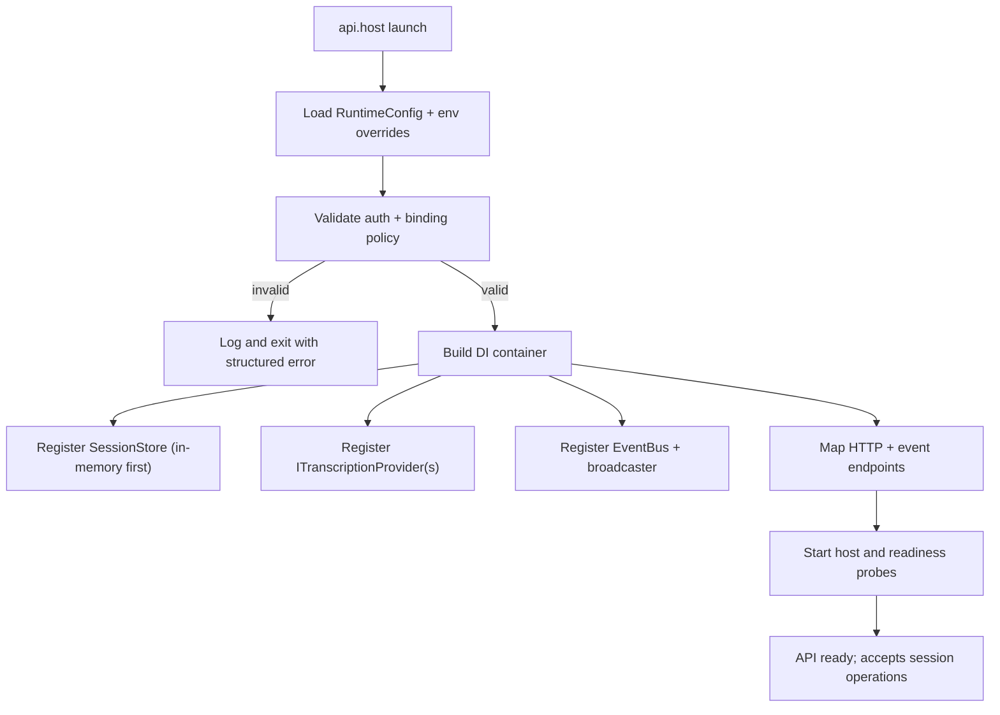
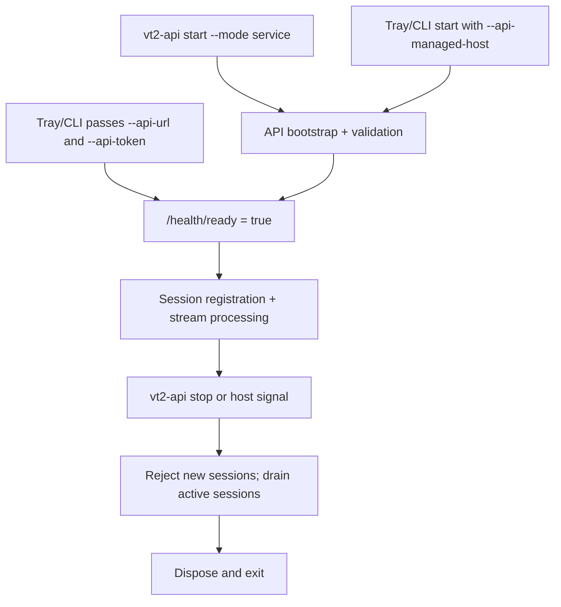
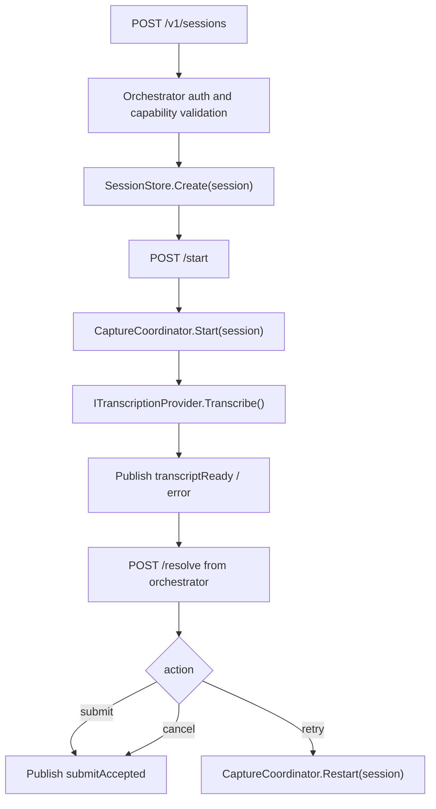

# Alpha Build 1 — API construction plan

## 1) Objective

Build a minimal but production-ready internal API runtime first, with clear startup, session handling, event streaming, and explicit contracts so orchestrators can be connected independently.

## 2) Project layout for day one

```text
VoiceType2/alpha-build-1/
  src/VoiceType2.Core/             # Domain contracts + policies + session state
  src/VoiceType2.Infrastructure/    # Internal provider clients + transport
  src/VoiceType2.ApiHost/          # ASP.NET Core API + host startup
  src/VoiceType2.App.Cli/          # CLI orchestrator (uses API, separate doc)
  scripts/                         # Build and run helpers
  RuntimeConfig.sample.json        # Runtime defaults used by docs and runtime defaults
```

- Keep app and infra concerns out of the API host; orchestrators are clients, not co-resident UI.
- Keep contracts in `src/VoiceType2.Core` and versioned.

## 3) API responsibility boundaries

- **Session Registry**: create, track, validate, and expire sessions.
- **Capture Orchestration**: bind recording settings and route transcription requests.
- **Event Stream Service**: broadcast status/transcript/error to specific session subscribers.
- **Security & policy**: authenticate orchestrators and enforce capability constraints.

## 4) Alpha build runtime bootstrap



- Start with in-memory session store for alpha build; persist later if required.
- Host must remain single process for initial release.
- Add `GET /health/live` and `GET /health/ready` for external checks.

### 4.1 Runtime modes and lifecycle policy

- `service mode`: API process launched directly, independent of any orchestrator.
- `attached mode`: orchestrator discovers existing local API and performs session registration only.
- `embedded mode`: orchestrator starts API as controlled child process (development/test convenience).



### 4.2 Settings ownership and reload policy

- API settings belong to `RuntimeConfig` only.
  - bind profile (`HostBinding`), auth mode, TLS, host policies, timeouts.
  - changes to these require API restart for alpha.
- Orchestrator settings stay local to each orchestrator and are passed in session registration payload.
- Shared contracts are versioned through `ContractVersion` and validated during registration.

## 5) Session lifecycle API (alpha)

| Method | Path                               | Responsibility                | Notes                                    |
|--------|------------------------------------|-------------------------------|------------------------------------------|
| `POST` | `/v1/sessions`                     | register orchestrator session | returns `sessionId`, `orchestratorToken` |
| `GET`  | `/v1/sessions/{sessionId}`         | read current status           | state + capabilities + errors            |
| `POST` | `/v1/sessions/{sessionId}/start`   | begin capture + transcription | idempotent for active sessions           |
| `POST` | `/v1/sessions/{sessionId}/stop`    | stop capture                  | returns final status                     |
| `POST` | `/v1/sessions/{sessionId}/resolve` | apply user decision           | actions: `submit`, `cancel`, `retry`     |
| `GET`  | `/v1/sessions/{sessionId}/events`  | SSE or WS stream              | transcript/status/error events           |

### 5.1 Canonical request/response models

```json
{
  "sessionId": "string",
  "correlationId": "string",
  "orchestratorId": "cli|tray|frontend",
  "platform": "windows|linux|macos",
  "capabilities": {
    "hotkeys": false,
    "tray": false,
    "clipboard": true
  }
}
```

```json
{
  "eventType": "status|transcript|command|error",
  "sessionId": "string",
  "correlationId": "string",
  "payload": {
    "state": "idle|listening|transcribing|readyForDecision|error",
    "text": "optional transcript",
    "errorCode": "optional",
    "errorMessage": "optional"
  }
}
```

## 6) Internal service flow



## 7) Concurrency and limits

- Max concurrent sessions should be configurable; default should start low for alpha (e.g. 4).
- Each session carries:
  - `sessionId`,
  - `correlationId` per operation,
  - simple transition lock (`idle -> active -> done -> closed`).
- Session timeout policy:
  - idle: close session after inactivity,
  - max age: hard limit,
  - no-op operation on closed session returns standardized `409`.

## 8) Alpha build error contract

All failures return:

```json
{
  "type": "about:blank",
  "title": "error title",
  "status": 400,
  "detail": "human-readable message",
  "errorCode": "SESSION_NOT_FOUND | INVALID_CAPABILITY | INVALID_TRANSITION",
  "correlationId": "string",
  "sessionId": "optional",
  "traceId": "optional"
}
```

## 9) Testability checkpoints

- Every endpoint should have one contract test that validates JSON schema and status codes.
- Session manager transitions should be deterministic when fed fixed events.
- Event stream should support deterministic replay in tests.
- In-memory session store and fake provider must fully cover start/stop/resolve failures.

## 10) Alpha acceptance criteria

- Start API with default config and expose health endpoints.
- Register at least two sessions at once without shared state collisions.
- One session can reach all states in the internal service flow.
- CLI can receive SSE/WS events and call `resolve`.
- No endpoint behavior depends on a specific orchestrator implementation.

## 11) Build and run commands for Alpha Build 1

```text
dotnet run --project VoiceType2/alpha-build-1/src/VoiceType2.ApiHost/VoiceType2.ApiHost.csproj --configuration Debug -- --mode service --urls "http://127.0.0.1:5240" --config "VoiceType2/alpha-build-1/RuntimeConfig.sample.json"
dotnet run --project VoiceType2/alpha-build-1/src/VoiceType2.ApiHost/VoiceType2.ApiHost.csproj -- --mode service --urls "http://127.0.0.1:5240" --environment Development
dotnet run --project VoiceType2/alpha-build-1/src/VoiceType2.ApiHost/VoiceType2.ApiHost.csproj -- --mode service --urls "http://127.0.0.1:5240" --help

dotnet run --project VoiceType2/alpha-build-1/src/VoiceType2.App.Cli/VoiceType2.App.Cli.csproj --configuration Debug -- run --api-url "http://127.0.0.1:5240"
dotnet run --project VoiceType2/alpha-build-1/src/VoiceType2.App.Cli/VoiceType2.App.Cli.csproj -- status --session-id "<session-id>" --api-url "http://127.0.0.1:5240"
dotnet run --project VoiceType2/alpha-build-1/src/VoiceType2.App.Cli/VoiceType2.App.Cli.csproj -- resolve submit --session-id "<session-id>" --api-url "http://127.0.0.1:5240"
```

CLI-driven API control target for alpha (planned):

- `vt2-api start --mode service --urls "http://127.0.0.1:5240"`
- `vt2-api stop --graceful-timeout-ms 15000`
- `vt2-api status`
- `vt2-api sessions list`

In the current Alpha-1 scaffold, startup and readiness are currently validated via:

- `vt2 api` (probes the configured `/health/ready`)

## 12) Alpha 1 one-command bootstrap (recommended sequence)

From the repository root:

```powershell
dotnet build VoiceType2/alpha-build-1/src/VoiceType2.ApiHost/VoiceType2.ApiHost.csproj -c Debug
dotnet build VoiceType2/alpha-build-1/src/VoiceType2.App.Cli/VoiceType2.App.Cli.csproj -c Debug

dotnet run --project VoiceType2/alpha-build-1/src/VoiceType2.ApiHost/VoiceType2.ApiHost.csproj -- --mode service --urls "http://127.0.0.1:5240"
```

Then in another terminal:

```powershell
dotnet run --project VoiceType2/alpha-build-1/src/VoiceType2.App.Cli/VoiceType2.App.Cli.csproj -- run --api-url "http://127.0.0.1:5240"
```

## 13) Alpha 1 testing strategy (implemented now, expandable in Alpha 1+)

- Unit: `ApiSessionClient` request/response and SSE parsing (newly added in `tests/VoiceType2.Alpha1.Tests`).
- API-only smoke: start API host, register session, start/stop, and assert terminal state transitions.
- Orchestrator smoke: CLI help and command wiring remains part of subsequent alpha increments once managed launch mode is fully implemented.

Preferred command:

```powershell
.\scripts\test-alpha1.ps1 -Configuration Debug
```
