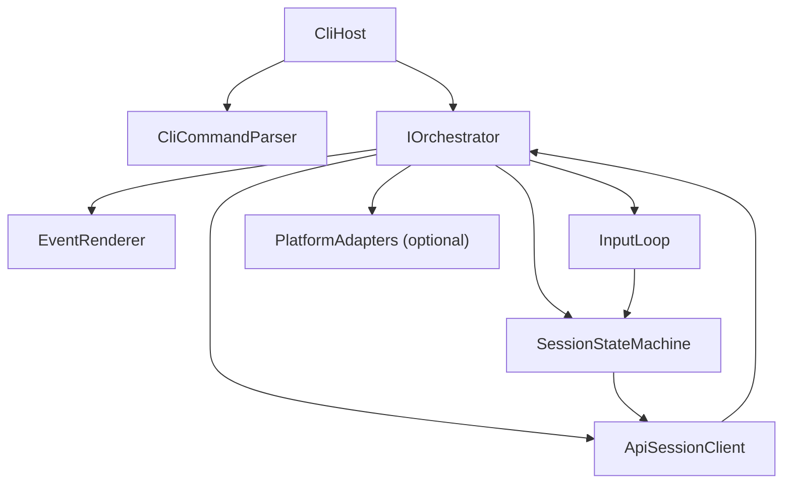
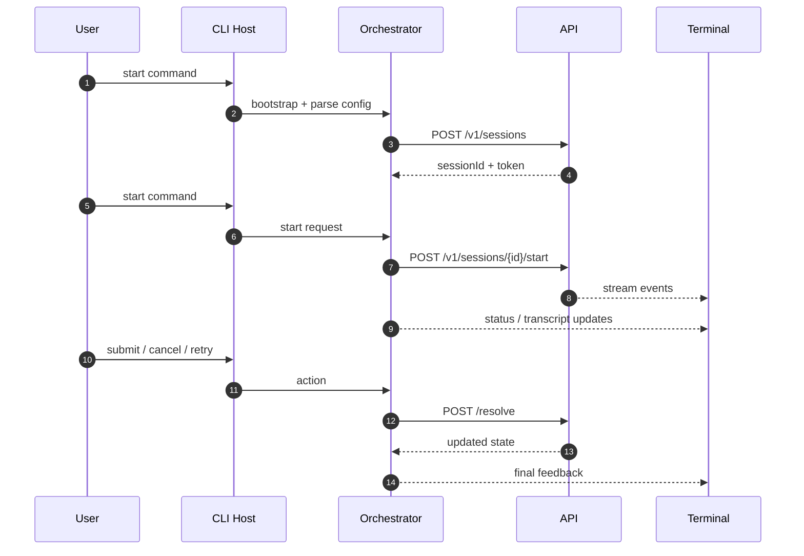
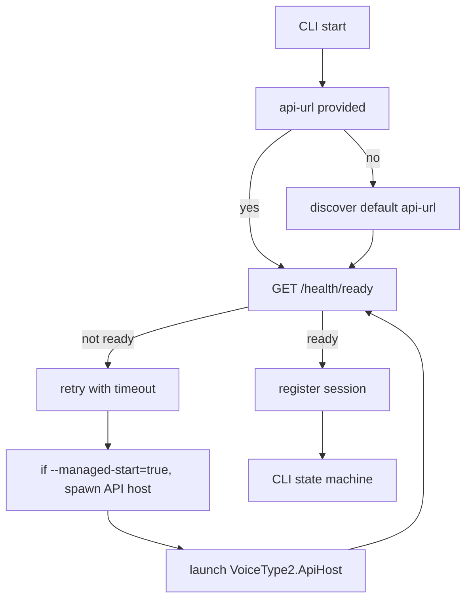

# Alpha Build 1 — CLI orchestrator blueprint

## 1) Objective

### Alpha 1 closeout status

- Managed mode now validates API readiness and attempts graceful child-process shutdown with timed fallback.
- Command surface currently includes `run`, `status`, `stop`, `resolve`, and `api` helpers; token handling and retry/submit/cancel actions are supported in the interactive run loop.
- `vt2 tui` / `vt2 --tui` is now implemented as a Spectre.Console-based interactive session interface.
- Closeout verification (2026-02-26): command behavior validated through API session client integration tests and smoke checks.

Build a CLI orchestrator that can:

- Register a session with the API,
- Start and stop capture,
- Render transcript events in terminal,
- Resolve transcripts (`submit`, `cancel`, `retry`),
- Run independently of the API process.

## 2) Responsibilities and non-responsibilities

- Responsibilities:
  - Orchestrator session lifecycle
  - Human interaction model
  - Local command parsing and status display
  - Optional helper adapters for hotkeys/notifications
- Non-responsibilities:
  - Audio capture implementation
  - Transcription transport details
  - Session policies and API host validation

## 3) Component layout



## 4) Minimal CLI run sequence



## 4.1 API connection model for CLI

CLI must support two startup styles from day one:

- **Attach mode**: expect a running API and connect immediately.
- **Managed mode**: if API is not available, optionally launch local API host (child process) and wait for `GET /health/ready`.



Suggested CLI command behavior:

- `vt2 run --mode attach --api-url <url>`: attach only.
- `vt2 run --mode managed --api-url <url>`: spawn + attach fallback.
- `vt2 run --api-timeout-ms 15000 --shutdown-timeout-ms 10000`.

## 5) Command set and API management (alpha)

For the Alpha-1 kickoff scaffold, the implementation currently supports a subset of the final contract.
Use the command list below as the runtime behavior target now, and the rest as post-Alpha-1 expansion.

- `vt2`:
  - interactive default when no command is supplied
- `vt2 run --mode attach|managed`:
  - start interactive loop and register session
- `vt2 tui --mode attach|managed`:
  - start Spectre.Console TUI session loop
- `vt2 status`:
  - interactive status display when used from run loop
- `vt2 stop`:
  - request session stop (requires `--session-id` when used outside run loop)
- `vt2 resolve submit|cancel|retry --session-id <id>`:
  - send `POST /v1/sessions/{id}/resolve`
- `vt2 tui [--mode attach|managed]`:
  - start same workflow as `run` with menu-driven terminal UI
Planned (not yet in the current scaffold):

- `vt2 api start [--port] [--urls]`:
  - management command to start local API (managed mode default in alpha)
- `vt2 api stop`:
  - stop managed API host
- `vt2 api config show`:
  - show effective endpoint + token profile

## 6) Data flow and state machine

States:

- `Uninitialized`
- `Configured`
- `Registered`
- `Running`
- `Listening`
- `AwaitingDecision`
- `Completed`
- `Stopped`
- `Failed`

Rules:

- `submit` from `AwaitingDecision` moves to `Completed`.
- `retry` from `AwaitingDecision` calls `POST /start` again.
- Any terminal event can move to `Stopped`.
- `start` is ignored unless state is `Registered` or `Completed`.

## 7) CLI command set (alpha)

- `vt2 run`
- `vt2 stop`
- `vt2 status`
- `vt2 resolve submit|cancel|retry`
- `vt2 config show`
- `vt2 exit`

Notes:

- For the current scaffold, `start`, `submit`, `cancel`, and `retry` are intentionally implemented in the interactive `run` loop and as `resolve` command aliases (`resolve submit|cancel|retry`).
- `stop`, `status`, and `resolve` are available as top-level commands.

## 8) Input and rendering contract

### Decision parsing

- `submit` and `s` resolve submit
- `cancel` and `c` resolve cancel
- `retry` and `r` resolve retry

### Output policy

- status line always prints: `sessionId`, state, last event, correlationId.
- transcripts print in a muted style, then one action line.
- error lines include standardized code and session id.

## 9) C# skeleton (alpha)

```csharp
public sealed record ApiEndpoints(Uri BaseUrl, string ApiToken);

public interface IOrchestrator
{
    Task<int> RunAsync(CancellationToken ct = default);
}

public interface IApiSessionClient
{
    Task<SessionCreated> RegisterAsync(OrchestratorProfile profile, CancellationToken ct = default);
    Task StartAsync(string sessionId, CancellationToken ct = default);
    Task StopAsync(string sessionId, CancellationToken ct = default);
    IAsyncEnumerable<ApiEvent> StreamEventsAsync(string sessionId, CancellationToken ct = default);
    Task ResolveAsync(string sessionId, string action, CancellationToken ct = default);
}

public sealed class CliOrchestrator : IOrchestrator
{
    public async Task<int> RunAsync(CancellationToken ct = default)
    {
        var profile = LoadProfile();
        var session = await _client.RegisterAsync(profile, ct);
        await _state.ConfigureAsync(session.SessionId, ct);

        await _render.ShowAsync("ready", ct);
        await ReadLoopAsync(ct); // parses submit/cancel/retry
        return 0;
    }
}
```

## 10) Optional platform adapters

- `IHotkeyAdapter`: optional, for users who want CLI hotkey support.
- `ITrayProbeAdapter`: optional, for environments where tray visibility must signal session state.
- `INotificationAdapter`: terminal + optional native fallback.
- `IClipboardFallbackAdapter`: optional local output sink when session actions include copy.

## 11) Alpha acceptance checklist

- CLI can register a session in one command.
- Event stream updates are rendered without delay.
- `submit/cancel/retry` resolves and returns deterministic status.
- CLI can run headless (no tray/hotkey dependencies).
- `stop` and `status` remain valid in every non-terminal state.

Recommended verification:

- `dotnet test VoiceType2/alpha-build-1/tests/VoiceType2.Alpha1.Tests/VoiceType2.Alpha1.Tests.csproj`
- `.\scripts\test-alpha1.ps1 -Configuration Debug`
